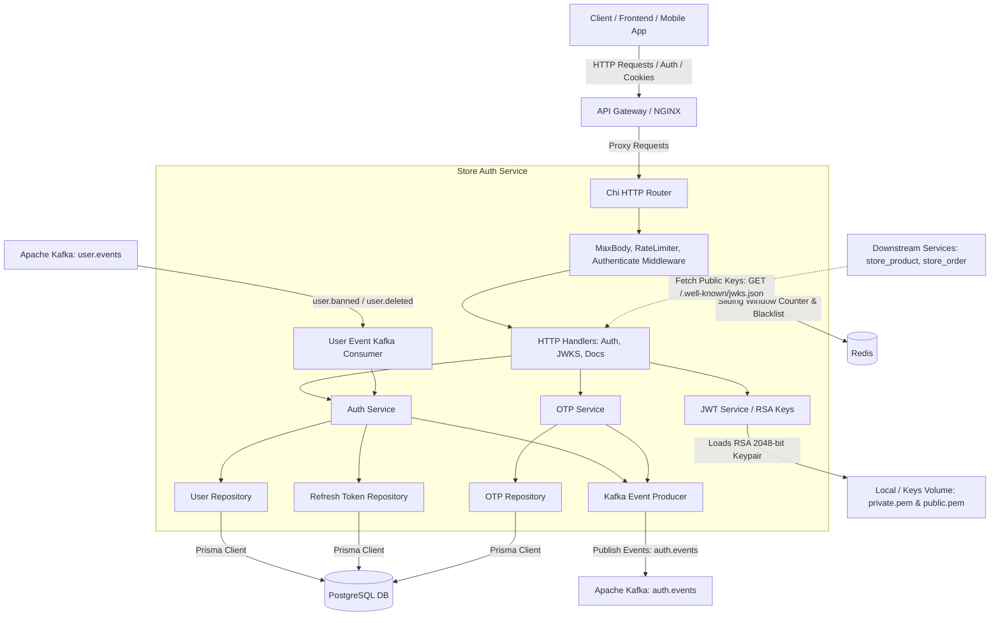
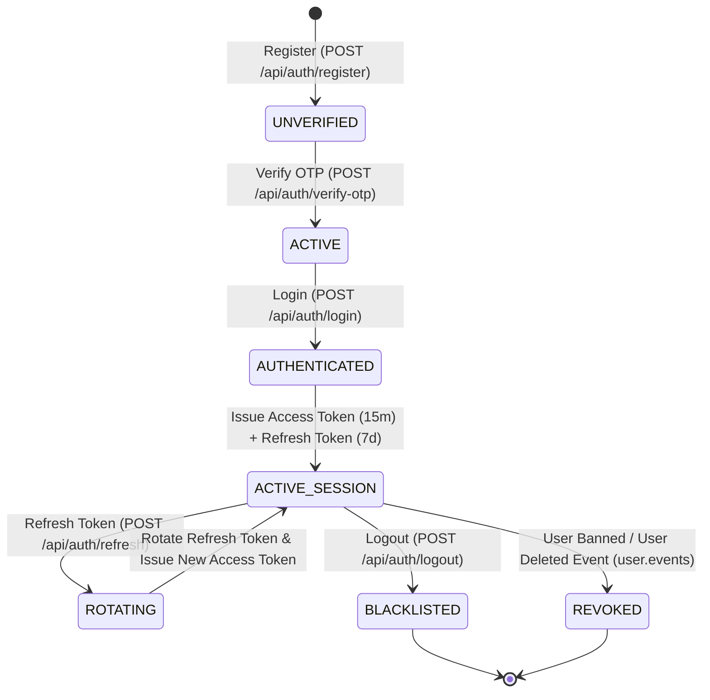

# Store Auth Microservice (`store_auth`)

[](https://go.dev/)
[](https://github.com/go-chi/chi)
[](https://www.postgresql.org/)
[](https://github.com/steebchen/prisma-client-go)
[](https://jwt.io/)
[](https://kafka.apache.org/)
[](https://redis.io/)

A production-grade, centralized identity provider and cryptographic authentication microservice built in Go. It manages user registration, email OTP 2FA verification, password resets, stateless RS256 JWT issuance, refresh token rotation, Redis token blacklisting, Redis sliding-window rate limiting, and exposes a public JWKS endpoint (`/.well-known/jwks.json`) for zero-network-latency token verification across downstream microservices.

---

## 📑 Table of Contents

- [Architecture Overview](#-architecture-overview)
  - [Service Architecture](#service-architecture)
  - [Authentication & Token Lifecycle](#authentication--token-lifecycle)
- [Key Features](#-key-features)
- [Technology Stack](#-technology-stack)
- [Repository Structure](#-repository-structure)
- [Prerequisites & Environment Configuration](#-prerequisites--environment-configuration)
- [Database Setup & Prisma ORM](#-database-setup--prisma-orm)
- [Getting Started (Local Development)](#-getting-started-local-development)
- [API Endpoints & Documentation](#-api-endpoints--documentation)
- [Downstream Microservice & JWKS Verification](#-downstream-microservice--jwks-verification)
- [Apache Kafka Event Pipeline](#-apache-kafka-event-pipeline)
- [Redis Rate Limiting & Token Blacklist](#-redis-rate-limiting--token-blacklist)
- [Testing](#-testing)
- [Docker Deployment](#-docker-deployment)

---

## 🏗 Architecture Overview

### Service Architecture



### Authentication & Token Lifecycle



---

## 🌟 Key Features

1. **Asymmetric RS256 JWT Signing & Public JWKS**: Signs tokens with an RSA 2048-bit private key. Downstream microservices can independently verify tokens locally in memory using the public key set from `GET /.well-known/jwks.json` with zero runtime database latency.
2. **Dual Authentication Transport**: Seamlessly supports both browser-based `HttpOnly`, `SameSite=Lax`, secure cookies (`access_token`, `refresh_token`) and mobile/service `Authorization: Bearer <token>` headers.
3. **Single-Use Refresh Token Rotation**: Implements strict refresh token rotation backed by PostgreSQL to mitigate replay attacks and detect token hijacking.
4. **Instant Token Revocation & Redis Blacklisting**: Revokes active access tokens on logout (`POST /api/auth/logout`) by storing token identifiers (`jti`) in Redis with a TTL matching remaining lifespan.
5. **OTP 2FA & Password Reset Workflows**: Dispatches 6-digit OTP codes for account verification and password resets with configurable expiry, rate limiting, and maximum attempt guards.
6. **Sliding-Window Rate Limiting**: Redis-backed sliding-window rate limiting on all public authentication routes (`/api/auth/*`) to prevent brute-force attacks, backed by a fail-open resilience strategy.
7. **Kafka Event Streaming & User Lifecycle Sync**: Publishes domain events to `auth.events` (dispatched to `store_notification`) and consumes account lifecycle events from `user.events` (`user.banned`, `user.deleted`) to invalidate sessions in real time.
8. **Embedded Interactive Documentation**: Live OpenAPI 3.1 specifications rendered via **Swagger UI** (`/docs` and `/swagger`).

---

## 🛠 Technology Stack

- **Language**: Go 1.25+
- **HTTP Routing**: [Chi v5](https://github.com/go-chi/chi) with CORS, recovery & logging middlewares
- **ORM & Data Layer**: [Prisma Client Go](https://github.com/steebchen/prisma-client-go) with PostgreSQL
- **Token Signing**: RS256 (RSA 2048-bit keypair) via [golang-jwt/jwt/v5](https://github.com/golang-jwt/jwt)
- **Caching & Rate Limiting**: [go-redis/v9](https://github.com/redis/go-redis)
- **Event Streaming**: [segmentio/kafka-go](https://github.com/segmentio/kafka-go)
- **Password Hashing**: bcrypt (Cost 12) via `golang.org/x/crypto/bcrypt`
- **API Documentation**: OpenAPI 3.1 & Embedded Swagger UI
- **Containerization**: Multi-stage Alpine Dockerfile

---

## 📁 Repository Structure

```
store_auth/
├── api/
│   └── openapi.yaml                  # Canonical OpenAPI 3.1 specification
├── cmd/
│   └── server/
│       └── main.go                   # Application bootstrap & dependency wiring
├── docs/
│   └── MICROSERVICE_INTEGRATION.md   # Downstream integration & API Gateway guide
├── internal/
│   ├── auth/                         # Authentication handler, service, model & repository
│   ├── config/                       # Environment configuration loader & validation
│   ├── docs/                         # Embedded Swagger UI handler & OpenAPI spec asset
│   ├── jwt/                          # RS256 token service, claims & JWKS handler
│   ├── middleware/                   # Rate limiting, JWT auth & body limit middleware
│   ├── otp/                          # One-Time Password service, repository & sender
│   ├── platform/
│   │   ├── kafka/                    # Kafka producer & consumer group reader
│   │   └── redis/                    # Redis client initialization & helper functions
│   ├── router/                       # Chi router topology & route definitions
│   ├── sanitizer/                    # Input sanitization helper functions
│   └── user/                         # User lifecycle Kafka consumer (banned, deleted events)
├── openspec/                         # OpenSpec specifications and planning artifacts
├── prisma/
│   └── schema.prisma                 # Prisma database schema definition
├── scripts/
│   └── gen_keys.go                   # RSA 2048-bit keypair generator script
├── Dockerfile                        # Multi-stage container build definition
├── go.mod / go.sum                   # Go module definitions
└── .env.example                      # Environment variable configuration template
```

---

## ⚙️ Prerequisites & Environment Configuration

### Prerequisites
- **Go**: Version 1.25 or higher
- **PostgreSQL**: Version 14 or higher (or Supabase)
- **Apache Kafka**: Version 3.x+
- **Redis**: Version 7.x+
- **Prisma CLI**: For schema migrations (`npm install -g prisma`)

### Configuration Options (`.env`)

Copy the example configuration file:
```bash
cp .env.example .env
```

| Variable | Type | Default | Description |
| :--- | :--- | :--- | :--- |
| `SERVER_PORT` / `PORT` | `string` | `8080` | HTTP port for the microservice |
| `ENV` | `string` | `development` | Application environment (`development` / `production`) |
| `DATABASE_URL` | `string` | *(Required)* | PostgreSQL connection string |
| `REDIS_URL` | `string` | `redis://localhost:6379` | Redis host and port connection string |
| `REDIS_PASSWORD` | `string` | `""` | Optional password for Redis authentication |
| `RATE_LIMIT_MAX_REQUESTS` | `int` | `10` | Maximum requests allowed per sliding window |
| `RATE_LIMIT_WINDOW_SECONDS` | `int` | `1` | Sliding rate limit window duration in seconds |
| `JWT_PRIVATE_KEY_PATH` | `string` | `./keys/private.pem` | Path to RSA 2048-bit private key PEM file |
| `JWT_PUBLIC_KEY_PATH` | `string` | `./keys/public.pem` | Path to RSA 2048-bit public key PEM file |
| `JWT_ACCESS_EXPIRY_MINUTES` | `int` | `15` | Access token lifespan in minutes |
| `JWT_REFRESH_EXPIRY_DAYS` | `int` | `7` | Refresh token lifespan in days |
| `BCRYPT_COST` | `int` | `12` | Hashing cost factor for password encryption |
| `OTP_PROVIDER` | `string` | `kafka` | OTP delivery provider (`kafka` or `mock`) |
| `OTP_EXPIRY_MINUTES` | `int` | `5` | OTP code validity lifespan in minutes |
| `OTP_MAX_ATTEMPTS` | `int` | `5` | Maximum allowed invalid OTP submission attempts |
| `KAFKA_BROKERS` | `string` | `localhost:9092` | Comma-separated list of Kafka broker addresses |
| `KAFKA_TOPIC_AUTH_EVENTS` | `string` | `auth.events` | Kafka topic for auth lifecycle domain events |
| `KAFKA_TOPIC_USER_EVENTS` | `string` | `user.events` | Kafka topic for incoming user lifecycle events |
| `KAFKA_CONSUMER_GROUP_AUTH` | `string` | `store-auth-user-events-group` | Kafka consumer group ID for user events |
| `ENABLE_USER_EVENTS_CONSUMER`| `bool` | `true` | Enable background Kafka user lifecycle consumer |

---

## 🗄 Database Setup & Prisma ORM

The project uses Prisma schema (`prisma/schema.prisma`) to maintain models and generate the Go client into `internal/db` or Prisma client packages.

1. **Push Schema to PostgreSQL Database**:
   ```bash
   go run github.com/steebchen/prisma-client-go db push
   # or using Prisma CLI:
   npx prisma db push --schema=./prisma/schema.prisma
   ```

2. **Generate Go Client**:
   ```bash
   go run github.com/steebchen/prisma-client-go generate
   ```

---

## 🚀 Getting Started (Local Development)

1. **Clone the repository**:
   ```bash
   git clone https://github.com/Sall-lah/store_auth.git
   cd store_auth
   ```

2. **Install Go Dependencies**:
   ```bash
   go mod download
   ```

3. **Generate RSA Keypair**:
   ```bash
   go run scripts/gen_keys.go
   ```

4. **Configure Environment Variables**:
   ```bash
   cp .env.example .env
   # Edit .env to set your DATABASE_URL, REDIS_URL, and KAFKA_BROKERS
   ```

5. **Run Database Migrations & Code Generation**:
   ```bash
   go run github.com/steebchen/prisma-client-go db push
   go run github.com/steebchen/prisma-client-go generate
   ```

6. **Run the Service**:
   ```bash
   go run cmd/server/main.go
   ```

   The service will start listening on `http://localhost:8080`.

---

## 📡 API Endpoints & Documentation

Interactive Swagger UI documentation is embedded directly into the microservice:
- **Swagger UI Dashboard**: [http://localhost:8080/docs](http://localhost:8080/docs) or [http://localhost:8080/swagger](http://localhost:8080/swagger)
- **OpenAPI 3.1 YAML**: [http://localhost:8080/docs/openapi.yaml](http://localhost:8080/docs/openapi.yaml)

### Endpoint Catalog

| Group | Method | Path | Auth / Headers | Rate Limited | Description |
| :--- | :--- | :--- | :--- | :--- | :--- |
| **Discovery** | `GET` | `/.well-known/jwks.json` | Public | No | Public RSA keys (JWKS) for token verification |
| **Docs** | `GET` | `/docs`, `/swagger` | Public | No | Embedded interactive Swagger UI dashboard |
| **Docs** | `GET` | `/docs/openapi.yaml` | Public | No | Raw OpenAPI 3.1 YAML specification |
| **Auth** | `POST` | `/api/auth/register` | Public | Yes | Register new unverified account and trigger OTP |
| **Auth** | `POST` | `/api/auth/verify-otp` | Public | Yes | Verify 6-digit OTP code, activate account & issue tokens |
| **Auth** | `POST` | `/api/auth/resend-otp` | Public | Yes | Resend verification OTP code |
| **Auth** | `POST` | `/api/auth/login` | Public | Yes | Authenticate credentials & receive access/refresh tokens |
| **Auth** | `POST` | `/api/auth/refresh` | Cookie / Bearer (Refresh) | Yes | Rotate refresh token and issue new access token |
| **Auth** | `POST` | `/api/auth/logout` | Public | No | Invalidate refresh token and blacklist access token |
| **Password** | `POST` | `/api/auth/forgot-password` | Public | Yes | Request password reset OTP code via email |
| **Password** | `POST` | `/api/auth/reset-password` | Public | Yes | Reset password using verified OTP code |
| **Profile** | `GET` | `/api/auth/me` | Cookie / `Bearer <token>` | No | Retrieve authenticated user profile |

---

## 🔐 Downstream Microservice & JWKS Verification

Downstream microservices (such as `store_order`, `store_product`, and `store_user`) verify user JWTs locally in-memory using public cryptographic keys from the `store_auth` JWKS endpoint:

1. **Fetch Key Set**: Fetch `GET /.well-known/jwks.json` during service initialization and cache in-memory.
2. **Verify Signature**: Verify the token signature with algorithm `RS256` using the matching `kid` (Key ID).
3. **Parse Claims**: Extract standard claims (`sub` as user ID, `email`, `role`, `exp`, `iss`).

For complete architectural patterns, NGINX API Gateway header propagation rules, anti-spoofing header stripping, and polyglot verification middleware examples (Go, Node.js, Python), refer to:

📖 **[Downstream Microservice & API Gateway Integration Guide](docs/MICROSERVICE_INTEGRATION.md)**

---

## 📦 Apache Kafka Event Pipeline

`store_auth` integrates asynchronously with the event-driven platform architecture via Apache Kafka for event dispatch and user lifecycle synchronization.

### Kafka Topics & Event Schemas

#### Outbound Domain Events (`auth.events`)

| Event Type | Trigger Condition | Payload Summary | Downstream Consumers |
| :--- | :--- | :--- | :--- |
| `auth.otp_created` | Registration or forgot-password OTP triggered | User ID, Email, OTP Code, Expiry, Purpose | `store_notification` (Sends Email/SMS) |
| `auth.user_registered` | User completes initial registration | User ID, Email, Registered Timestamp | `store_user`, Analytics |
| `auth.user_logged_in` | Successful user authentication | User ID, Email, Login Timestamp, IP Address | Audit / Security Loggers |
| `auth.password_reset` | Password successfully reset via OTP | User ID, Email, Reset Timestamp | `store_notification` (Security Alert) |

#### Inbound Consumer Events (`user.events`)

| Event Type | Source Service | Action in `store_auth` | Session Impact |
| :--- | :--- | :--- | :--- |
| `user.banned` | `store_user` | Sets user status to `BANNED`, revokes all active refresh tokens in DB | Instantly terminates active sessions |
| `user.deleted` | `store_user` | Anonymizes user credentials, deletes refresh tokens, and blacklists active tokens | Permanent account & session termination |

---

## 🛡 Redis Rate Limiting & Token Blacklist

### Sliding-Window Rate Limiting

The service implements sliding-window counter rate limiting to protect authentication endpoints against brute-force credential stuffing and OTP enumeration:

| Scope / Route | Default Limit | Default Window | Strategy / Key |
| :--- | :--- | :--- | :--- |
| **Auth Routes (`/api/auth/*`)** | 10 req | 1 second | Client IP address (`ip:<ip>`) |

- **Fail-Open Resilience**: If Redis is unreachable or experiences network latency, the rate limiter automatically fails open to prevent service outages.
- **Response Headers**:
  - `X-RateLimit-Limit`: Maximum requests allowed in the current window.
  - `X-RateLimit-Remaining`: Remaining request quota.
  - `Retry-After`: Seconds until quota replenishment on `429 Too Many Requests`.

### Redis Token Blacklisting

When a user logs out (`POST /api/auth/logout`):
- The access token's unique ID (`jti`) is persisted in Redis with key `blacklist:<jti>`.
- The Redis key TTL is set to the token's remaining validity duration, ensuring instant revocation while automatically freeing memory upon token expiry.

---

## 🧪 Testing

Execute the test suite using standard Go tooling:

```bash
# Run all test packages
go test -v ./...

# Run test suite with race detector and coverage
go test -race -cover ./...
```

---

## 🐳 Docker Deployment

A production-ready, multi-stage Docker build is provided. Ensure RSA keys exist in `./keys/` before starting:

1. **Generate RSA Keys**:
   ```bash
   go run scripts/gen_keys.go
   ```

2. **Build Container Image**:
   ```bash
   docker build -t store_auth:latest .
   ```

3. **Run Container**:
   ```bash
   docker run -d \
     --name store_auth \
     -p 8080:8080 \
     --env-file .env \
     -v ./keys:/app/keys:ro \
     store_auth:latest
   ```

4. **Verify Health & Logs**:
   ```bash
   docker logs -f store_auth
   ```
